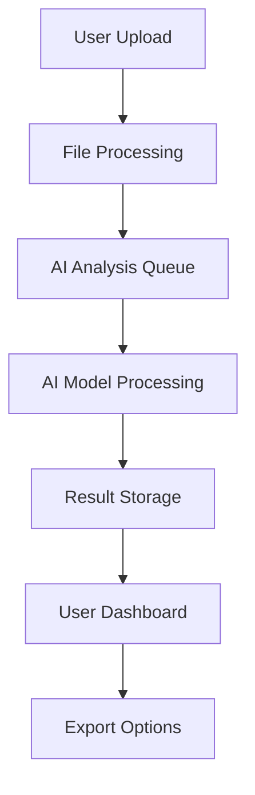

# Inleiding: De AI SaaS Revolutie

De **custom AI SaaS markt** groeit explosief. Bedrijven zoeken naar **op maat gemaakte AI-oplossingen** die perfect aansluiten bij hun specifieke workflows en behoeften. Dit opent ongekende mogelijkheden voor ondernemers en development teams.

In deze gids leer je hoe je **in slechts 8 weken** van idee naar werkende MVP gaat, met een focus op **praktische implementatie** en **snelle marktvalidatie**.

> *"De bedrijven die nu custom AI SaaS bouwen, creëren de platforms van morgen. Speed to market is cruciaal."* - Marc Andreessen, a16z

## Week 1-2: Concept & Market Validation

### Stap 1: Problem-Solution Fit Valideren

Voordat je ook maar één regel code schrijft, moet je **crystal clear** zijn over:

- **Welk specifiek probleem** los je op?
- **Voor wie** los je het op?
- **Waarom** kunnen bestaande tools dit niet?
- **Hoeveel** zijn klanten bereid te betalen voor een oplossing?

**Validation Framework:**
```
📋 Problem Interview Checklist:
✅ 20+ interviews met potential users
✅ Pain point scoring (1-10 schaal)
✅ Current solution analysis
✅ Willingness to pay validation
✅ Feature prioritization exercise
```

### Stap 2: AI Use Case Definition

**Succesvolle AI SaaS producten** focussen op **één core AI capability** die exceptioneel goed werkt:

- **Document Intelligence** (extractie, classificatie, samenvatting)
- **Predictive Analytics** (forecasting, risk assessment)
- **Natural Language Processing** (chatbots, content generatie)
- **Computer Vision** (object detection, quality control)
- **Recommendation Engines** (personalisatie, matching)

**Case Study - Document Intelligence SaaS:**
- **Problem**: Handmatige verwerking van contracten kost 4-6 uur per document
- **Solution**: AI die contracten analyseert en key terms extraheert in <2 minuten
- **Market**: Legal firms, real estate, procurement teams
- **MVP Scope**: PDF upload → AI analysis → structured data export

## Week 3-4: Technical Architecture & AI Integration

### Stap 3: Tech Stack Selection

**Recommended MVP Stack:**

**Frontend:**
```typescript
// React + TypeScript voor snelle development
// Next.js voor server-side rendering
// Tailwind CSS voor rapid UI development
// shadcn/ui voor consistent design system
```

**Backend:**
```python
# FastAPI voor high-performance APIs
# PostgreSQL voor reliable data storage  
# Redis voor caching en session management
# Celery voor background AI processing
```

**AI Layer:**
```python
# OpenAI GPT-4 voor general intelligence
# Anthropic Claude voor complex reasoning
# Hugging Face Transformers voor custom models
# LangChain voor AI workflow orchestration
```

**Infrastructure:**
```yaml
# Vercel/Netlify voor frontend deployment
# Railway/Render voor backend hosting
# Supabase voor database + auth
# Stripe voor payment processing
```

### Stap 4: MVP Architecture Design



**Key Architectural Decisions:**
- **Async processing** voor AI tasks (prevents timeouts)
- **Webhook notifications** voor completion updates
- **Tiered storage** (hot/cold data based on usage)
- **API-first design** voor toekomstige integraties

## Week 5-6: Core Development Sprint

### Stap 5: Authentication & User Management

**MVP Auth Requirements:**
```typescript
interface User {
  id: string;
  email: string;
  plan: 'free' | 'pro' | 'enterprise';
  usage: {
    monthly_requests: number;
    limit: number;
  };
  created_at: Date;
}
```

**Implementation met Supabase:**
```typescript
// Quick setup voor auth + database
import { createClient } from '@supabase/supabase-js'

const supabase = createClient(
  process.env.NEXT_PUBLIC_SUPABASE_URL,
  process.env.SUPABASE_ANON_KEY
)

// User registration
const signUp = async (email: string, password: string) => {
  const { data, error } = await supabase.auth.signUp({
    email,
    password,
  })
  return { data, error }
}
```

### Stap 6: AI Processing Pipeline

**Document Processing Example:**
```python
from fastapi import FastAPI, File, UploadFile
import openai
from celery import Celery

app = FastAPI()
celery_app = Celery('ai_processor')

@app.post("/process-document")
async def process_document(file: UploadFile):
    # Queue AI processing
    task = process_with_ai.delay(file.filename, file.content)
    return {"task_id": task.id, "status": "processing"}

@celery_app.task
def process_with_ai(filename: str, content: bytes):
    # AI processing logic
    response = openai.ChatCompletion.create(
        model="gpt-4",
        messages=[{
            "role": "system",
            "content": "Extract key information from this document..."
        }, {
            "role": "user", 
            "content": content.decode()
        }]
    )
    
    # Store results
    return response.choices[0].message.content
```

### Stap 7: User Interface Development

**Clean Dashboard Design:**
```tsx
// AI Processing Dashboard Component
export function ProcessingDashboard() {
  const { data: jobs } = useQuery('processing-jobs', fetchJobs)
  
  return (
    <div className="grid gap-6">
      <ProcessingStats />
      <JobsTable jobs={jobs} />
      <ResultsExport />
    </div>
  )
}

// Real-time status updates
export function JobStatus({ jobId }: { jobId: string }) {
  const { data: status } = useQuery(
    ['job-status', jobId],
    () => fetchJobStatus(jobId),
    { refetchInterval: 2000 }
  )
  
  return (
    <StatusBadge 
      status={status} 
      className="animate-pulse"
    />
  )
}
```

## Week 7: Integration & Testing

### Stap 8: Payment Integration

**Stripe Implementation:**
```typescript
// Subscription setup
const createSubscription = async (customerId: string, priceId: string) => {
  const subscription = await stripe.subscriptions.create({
    customer: customerId,
    items: [{ price: priceId }],
    metadata: {
      feature_limits: JSON.stringify({
        monthly_requests: 1000,
        file_size_mb: 10
      })
    }
  })
  
  return subscription
}

// Usage tracking
const trackUsage = async (userId: string, requests: number) => {
  await stripe.subscriptionItems.createUsageRecord(
    subscriptionItemId,
    { quantity: requests }
  )
}
```

### Stap 9: API Documentation & Testing

**Automated API Docs met FastAPI:**
```python
@app.post("/analyze", response_model=AnalysisResult)
async def analyze_document(
    file: UploadFile = File(...),
    options: AnalysisOptions = Body(...)
) -> AnalysisResult:
    """
    Analyze uploaded document with AI
    
    - **file**: Document to analyze (PDF, DOCX, TXT)
    - **options**: Analysis configuration options
    - **returns**: Structured analysis results
    """
    # Implementation here
```

**Testing Strategy:**
```python
# Unit tests voor AI processing
def test_document_analysis():
    result = analyze_document(sample_pdf)
    assert result.confidence > 0.8
    assert len(result.entities) > 0

# Integration tests voor full workflow  
async def test_full_processing_pipeline():
    # Upload → Process → Results → Export
    task_id = await upload_document(test_file)
    result = await wait_for_completion(task_id)
    assert result.status == "completed"
```

## Week 8: Launch Preparation & Go-to-Market

### Stap 10: Performance Optimization

**Critical Performance Metrics:**
- **API Response Time**: <200ms voor sync endpoints
- **AI Processing Time**: <30 seconden voor standard documents  
- **Uptime**: 99.9% availability target
- **Error Rate**: <1% processing failures

**Optimization Techniques:**
```python
# Caching voor frequent requests
@lru_cache(maxsize=100)
def get_ai_response(document_hash: str):
    # Expensive AI processing
    pass

# Connection pooling
engine = create_engine(
    DATABASE_URL,
    pool_size=20,
    max_overflow=0
)

# Async processing voor better throughput
async def process_batch(documents: List[Document]):
    tasks = [process_single(doc) for doc in documents]
    results = await asyncio.gather(*tasks)
    return results
```

### Stap 11: Monitoring & Analytics

**Essential Tracking:**
```typescript
// User behavior tracking
const trackEvent = (event: string, properties: object) => {
  analytics.track(event, {
    ...properties,
    timestamp: new Date(),
    user_plan: user.plan
  })
}

// AI performance monitoring  
const logAIMetrics = (processing_time: number, accuracy: number) => {
  logger.info('AI Processing Complete', {
    processing_time,
    accuracy,
    model_version: 'gpt-4-1106-preview'
  })
}
```

### Stap 12: Launch Strategy

**Soft Launch Checklist:**
```
🚀 Pre-Launch (Week 8):
✅ Beta testing met 20+ early users
✅ Performance load testing
✅ Security audit & penetration testing  
✅ Legal compliance check (GDPR, privacy)
✅ Customer support workflow setup

📈 Launch Week:
✅ Product Hunt submission
✅ Industry newsletter outreach
✅ LinkedIn/Twitter launch announcements
✅ Free trial promotions
✅ Customer success stories preparation
```

## Pricing Strategy & Business Model

### Freemium Model Example

| Plan | Price | Features |
|------|--------|----------|
| **Free** | €0/maand | 10 documents/month, basic AI analysis |
| **Pro** | €49/maand | 500 documents/month, advanced features, API access |  
| **Enterprise** | €199/maand | Unlimited, custom models, priority support |

### Revenue Projections

**Conservative Growth Model:**
- **Month 1**: 50 signups, 5 paid conversions (€245 MRR)
- **Month 3**: 200 signups, 25 paid conversions (€1,225 MRR)
- **Month 6**: 500 signups, 75 paid conversions (€3,675 MRR)
- **Month 12**: 1000+ signups, 200+ paid conversions (€9,800+ MRR)

## Veel Voorkomende Valkuilen & Hoe Ze Te Vermijden

### 1. Over-Engineering in MVP Fase

❌ **Fout**: Perfecte AI model accuracy nastreven vanaf dag 1
✅ **Oplossing**: Start met 80% accuracy, itereer op basis van user feedback

### 2. Onderschatten van AI Kosten

❌ **Fout**: Geen cost monitoring voor API calls
✅ **Oplossing**: Implement usage limits en cost alerts vanaf dag 1

### 3. Negeren van Data Privacy

❌ **Fout**: User data opslaan zonder expliciete consent
✅ **Oplossing**: Privacy-by-design, data minimization, clear consent flows

### 4. Geen Clear Value Proposition

❌ **Fout**: "We hebben AI" als selling point
✅ **Oplossing**: Focus op concrete business outcomes en tijd/kosten besparing

## Conclusie: Van MVP naar Schaalbare Business

Een **succesvolle AI SaaS** bouwen is niet alleen een technical challenge, maar vereist **strategisch product thinking** en **customer-centric development**.

**Key Success Factors:**
🎯 **Problem-first approach** - Los een echt probleem op
🚀 **Speed to market** - MVP in 8 weken, itereer daarna  
💡 **AI als enabler** - Niet als doel op zich
📊 **Data-driven decisions** - Meet alles, optimaliseer continu
🤝 **Customer feedback loops** - Blijf dicht bij je users

### Next Steps Na Launch

**Maand 2-3: Product-Market Fit Optimization**
- User feedback integration
- Feature usage analytics
- Pricing optimization
- Customer success stories

**Maand 4-6: Scale Preparation**  
- Infrastructure scaling
- Team expansion
- Advanced AI features
- Enterprise sales process

**Maand 7-12: Market Expansion**
- New use cases development
- Integrations ecosysteem
- International expansion
- Funding/investment readiness

---

## Klaar om te Starten met je AI SaaS?

Heb je een idee voor een custom AI SaaS oplossing maar weet je niet waar te beginnen? **Plan een gratis strategy sessie** waarin we jouw concept valideren en een concrete development roadmap opstellen.

[**Plan je gratis AI SaaS Strategy Sessie →**](/contact)

*Van idee tot MVP in 8 weken - laat ons je begeleiden naar AI SaaS succes.*